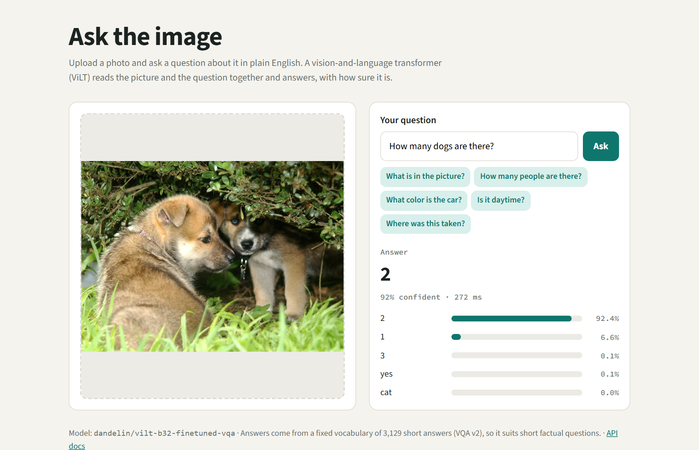
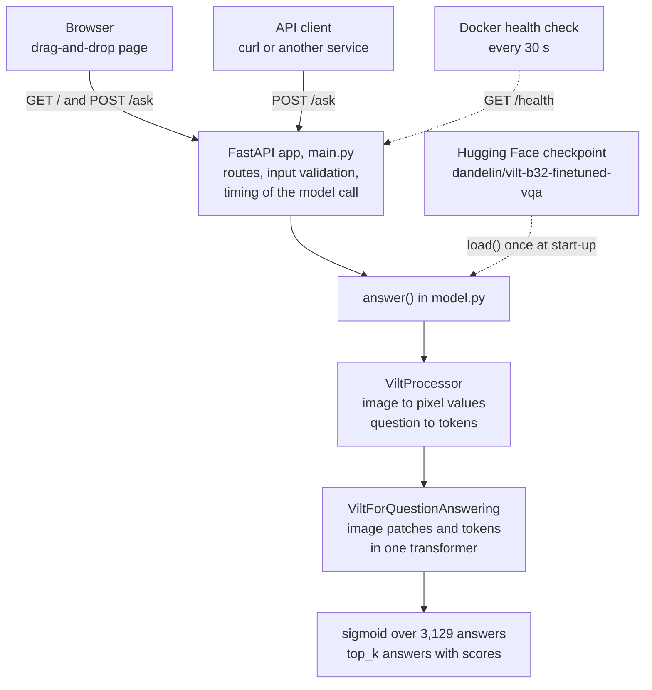
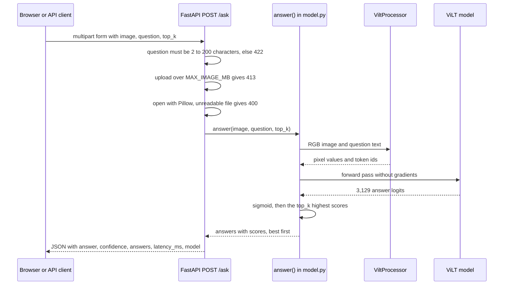
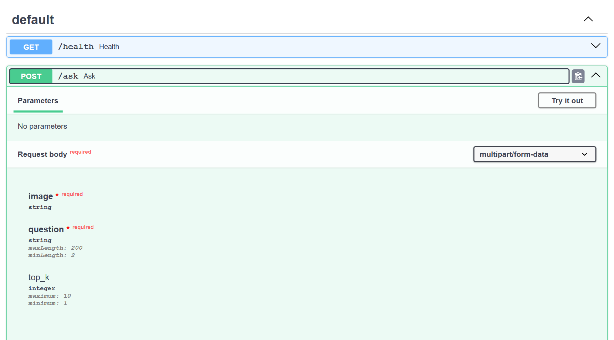

# Visual Question Answering API (ViLT + FastAPI + Docker)


-yellow)


**Upload a photo, ask a question about it in plain English, and get the top answers with a confidence score for
each.** A multimodal AI service: the ViLT vision-and-language transformer served through a FastAPI REST API, with a
drag-and-drop web page and a Docker image that has the model weights built in. It is for developers who want a small,
production-shaped example of serving a vision-language model, and for anyone who wants to try visual question
answering on their own photos.



## Key features

- **Visual question answering:** "How many people are there?", "What colour is the car?", "Is it raining?" The model
  reads the image and the question together.
- **Top answers with confidence:** five answers by default (`top_k` from 1 to 10), each with its score, so a client can
  decide when to trust the result.
- **REST API and web UI:** `POST /ask` takes a multipart image and question, `GET /health` is a readiness check,
  interactive OpenAPI docs are at `/docs`, and a drag-and-drop page with example questions is at `/`.
- **Input validation:** questions of 2 to 200 characters, an image size cap (8 MB by default) and a clear error for
  files that aren't readable images.
- **Model loaded once at start-up,** so the first question doesn't wait for it. Every response reports how long the
  model took.
- **Docker image:** CPU-only PyTorch, model weights downloaded at build time, a non-root user and a health check.
  `docker compose up` starts it.
- **CI on every push:** API tests with the model mocked, plus a Docker job that builds the image, waits for `/health`
  and asks a real question.

## Architecture



`main.py` holds the web layer: routes, validation and timing. `model.py` is the only module that touches the model:
`load()` builds the processor and model once per process (cached with `lru_cache`, in evaluation mode) and `answer()`
runs one question. The Docker image downloads the checkpoint at build time into `HF_HOME=/opt/hf`, so a container
starts without a download.

## How it works



1. **Start-up.** FastAPI's lifespan hook calls `model.load()`, which downloads (or reads from the cache) the processor
   and the model and keeps them in memory. Setting `VQA_PRELOAD=0` skips this, and the model then loads on the first
   question.
2. **Validation.** `POST /ask` strips the question and rejects anything under 2 or over 200 characters (422). It reads
   at most `MAX_IMAGE_MB` plus one byte of the upload and rejects larger files (413), then opens the bytes with Pillow
   and rejects anything it can't decode (400).
3. **Encoding.** The processor resizes the image so its shorter side is 384 pixels and normalises it, and turns the
   question into lower-case BERT word-piece tokens, truncated to the model's 40-token limit.
4. **Inference.** [ViLT](https://arxiv.org/abs/2102.03334) (Kim et al., 2021) cuts the image into 32 x 32 patches and
   feeds them, together with the question tokens, through a single transformer, with no convolutional backbone or
   object detector. Its question-answering head scores 3,129 candidate answers.
5. **Scoring.** The checkpoint was trained with binary cross-entropy over soft answer scores, so each answer's sigmoid
   is read as its confidence. The `top_k` highest are returned, best first.
6. **Response.** `answer` and `confidence` are the top answer and its score, `answers` lists all `top_k`,
   `latency_ms` is the time spent in the model, and `model` names the checkpoint.

### Model and scope

The default checkpoint, `dandelin/vilt-b32-finetuned-vqa`, is ViLT fine-tuned on VQA v2: it chooses each answer from
3,129 short answers. It is best at short factual answers: counting, colours, yes/no and naming objects. Long
descriptions and reading longer text from an image fall outside that answer set. Scores are independent sigmoid
outputs, so the scores of the top answers need not add up to 1. `VQA_MODEL` selects another ViLT
question-answering checkpoint from the Hugging Face Hub.

## Screenshots

| Web page | API docs |
|---|---|
|  |  |
| Drop or choose a photo, type a question or click an example, and read the answer, its confidence, the latency and a bar for each of the top five answers. | `/docs` documents the API endpoints and lets you send a request from the browser with **Try it out**. |

## Tech stack

Python 3.11 · PyTorch (CPU build) · Hugging Face Transformers · ViLT · FastAPI · Uvicorn · Pillow · Docker and
Docker Compose · pytest · GitHub Actions

**Keywords:** multimodal AI, visual question answering, VQA, vision-language model, computer vision, NLP,
transformers, Hugging Face, model serving, ML deployment, REST API, FastAPI, Docker, MLOps.

## Getting started

### Prerequisites

- Docker with Docker Compose, or Python 3.11 (the version CI and the Docker image use).
- About 470 MB of disk space for the model weights, which are downloaded on the first build or start.

### Run with Docker

```bash
git clone https://github.com/samiulhuda360/visual-question-answering-api
cd visual-question-answering-api
docker compose up --build        # then open http://localhost:8000
```

The build installs the CPU build of PyTorch and downloads the model weights into the image. Compose publishes port
8000 and restarts the container unless you stop it.

### Run locally

```bash
pip install torch --index-url https://download.pytorch.org/whl/cpu
pip install -r requirements.txt
uvicorn main:app --port 8000     # the first start downloads the model, about 470 MB
```

Then open http://localhost:8000.

### Configuration

All settings are optional environment variables:

| Variable | Default | Purpose |
|---|---|---|
| `VQA_MODEL` | `dandelin/vilt-b32-finetuned-vqa` | Hugging Face ID of the ViLT question-answering checkpoint |
| `MAX_IMAGE_MB` | `8` | largest accepted upload, in MB |
| `VQA_PRELOAD` | `1` | `1` loads the model at start-up; `0` loads it on the first question (the tests use `0`) |
| `HF_HOME` | Hugging Face's default cache | where the model weights are stored; the Docker image sets `/opt/hf` |

The Docker image contains the default checkpoint only, so a different `VQA_MODEL` is downloaded when the container
starts.

## Usage

### Web page

1. Open http://localhost:8000.
2. Drop an image on the left panel, or click it to choose a file.
3. Type a question, or click one of the example questions.
4. Read the answer, its confidence and the latency, with a bar for each of the top five answers.

### API

```bash
curl -F "image=@puppies.jpg" -F "question=How many dogs are there?" http://localhost:8000/ask
```

The response for the photo in the screenshot:

```json
{
  "question": "How many dogs are there?",
  "answer": "2",
  "confidence": 0.9238,
  "answers": [{"answer": "2", "score": 0.9238}, {"answer": "1", "score": 0.0661}, {"answer": "3", "score": 0.0013}, "..."],
  "latency_ms": 272,
  "model": "dandelin/vilt-b32-finetuned-vqa"
}
```

| Endpoint | Input | Output |
|---|---|---|
| `GET /` | | the web page |
| `GET /health` | | `{"status": "ok", "model": "dandelin/vilt-b32-finetuned-vqa"}` |
| `POST /ask` | multipart form: `image` (file, required), `question` (2 to 200 characters, required), `top_k` (1 to 10, default 5) | `question`, `answer`, `confidence`, `answers` (each with `answer` and `score`), `latency_ms`, `model` |
| `GET /docs` | | interactive OpenAPI docs |

| Status | When |
|---|---|
| `400` | the file isn't an image Pillow can read (JPEG, PNG, WebP, GIF, BMP) |
| `413` | the image is larger than `MAX_IMAGE_MB` |
| `422` | the question is missing, shorter than 2 or longer than 200 characters, or `top_k` is outside 1 to 10 |

## Project structure

```
.
├── main.py                    FastAPI app: GET /, GET /health and POST /ask, with validation and timing
├── model.py                   loads ViLT once and returns the top-k answers with scores
├── static/index.html          drag-and-drop web page (no build step)
├── tests/test_api.py          API tests with the model mocked
├── docs/                      README screenshots
├── Dockerfile                 CPU-only PyTorch, model weights built in, non-root user, health check
├── compose.yaml               one-command start on port 8000
├── requirements.txt           runtime dependencies (PyTorch is installed separately, CPU build)
├── requirements-dev.txt       test dependencies: pytest and httpx
├── pytest.ini                 test settings
└── .github/workflows/ci.yml   tests and a Docker smoke test on every push and pull request
```

## Testing

```bash
pip install -r requirements.txt -r requirements-dev.txt
pytest -q
```

The tests replace `model.answer` with a stub and set `VQA_PRELOAD=0`, so they run in seconds without PyTorch or the
model download. They cover:

- a question about an image returns the answer, its confidence and the list of answers (200)
- a file that isn't an image is rejected (400)
- a blank question is rejected (422)
- `/health` reports `ok` and `/` serves the web page

**CI** ([`.github/workflows/ci.yml`](.github/workflows/ci.yml)) runs on every push and pull request:

- **test:** Python 3.11, the CPU build of PyTorch, the requirements, then `pytest -q`.
- **docker:** builds the image, starts a container, polls `/health` (up to 60 tries, 3 seconds apart), then posts a
  generated 224 x 224 red PNG with the question "What color is this?" and checks that the JSON reply has an answer.

## Licence and credits

- Model: [`dandelin/vilt-b32-finetuned-vqa`](https://huggingface.co/dandelin/vilt-b32-finetuned-vqa), Apache 2.0.
- Method: [ViLT: Vision-and-Language Transformer Without Convolution or Region Supervision](https://arxiv.org/abs/2102.03334),
  Kim et al., 2021.
- Screenshot photo: [Two German Shepherd puppies](https://commons.wikimedia.org/wiki/File:Two_German_Shepherd_puppies.jpg),
  Wikimedia Commons, public domain.

## Author

[Samiul Huda](https://github.com/samiulhuda360) · MSc Data Science · Auckland, New Zealand
